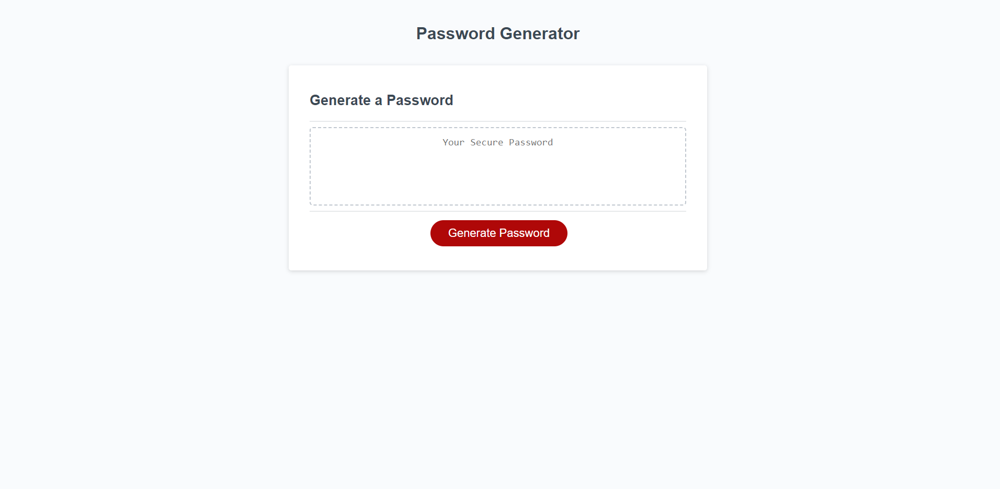

# Password Generator

## The Password Generator allows a user to randomly select the criteria that want, which includes Uppercase/lower case letters, numbers and symbols. Once the criteria is selected a random password is generated meeting the length they choose. The length must be between 8 and 128 characters. This allows the user to leave the generator with a random password made up of different characters so they don't have to create one on there own.

GitHub-pages: https://github.com/seth89/challenge-3-password-generator 
Link to website: https://seth89.github.io/challenge-3-password-generator/

